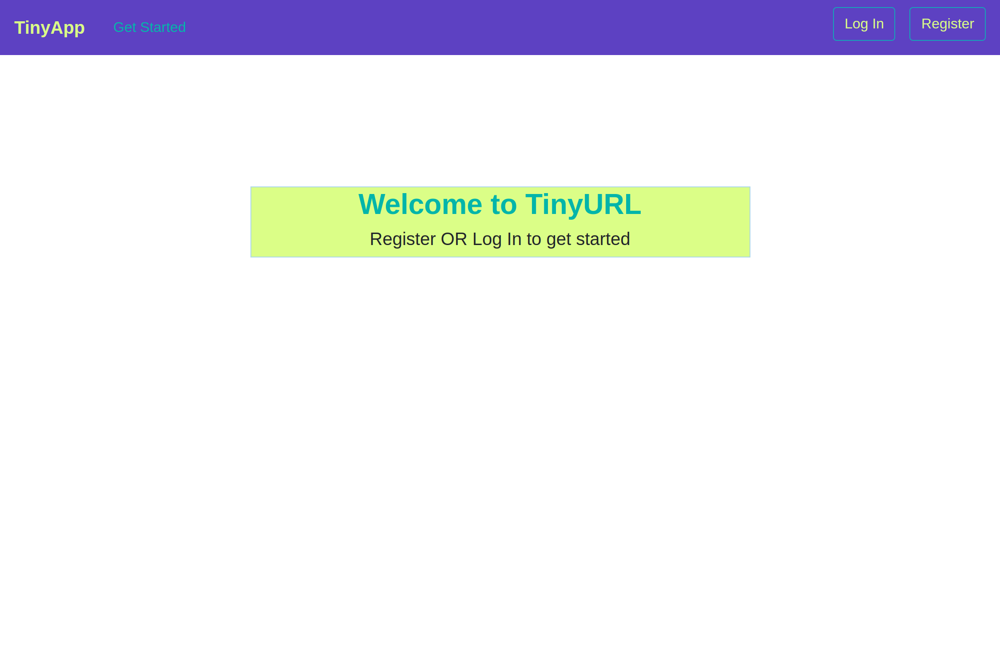
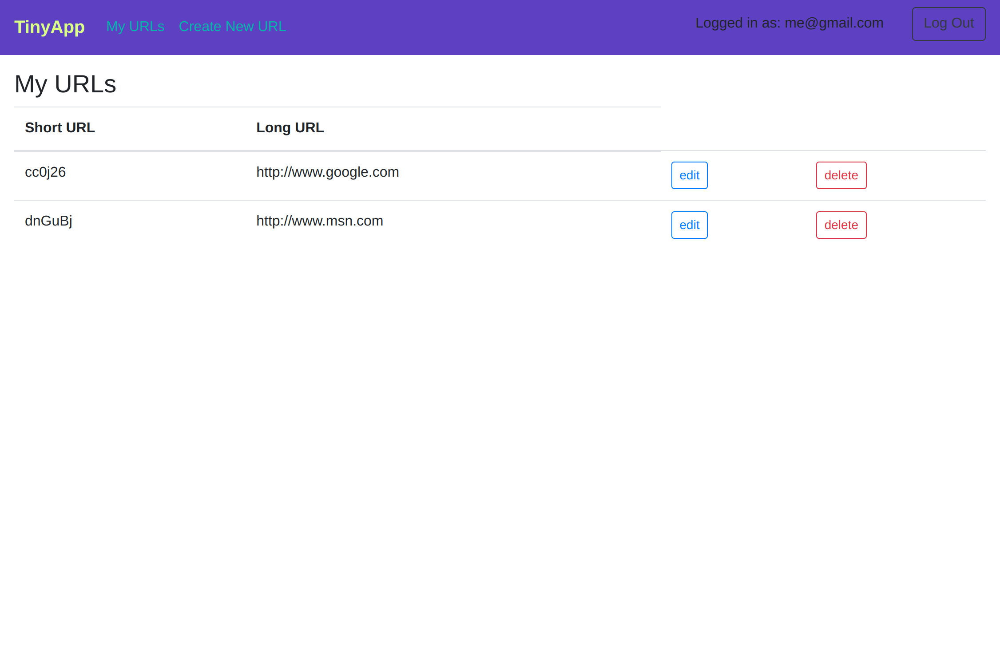
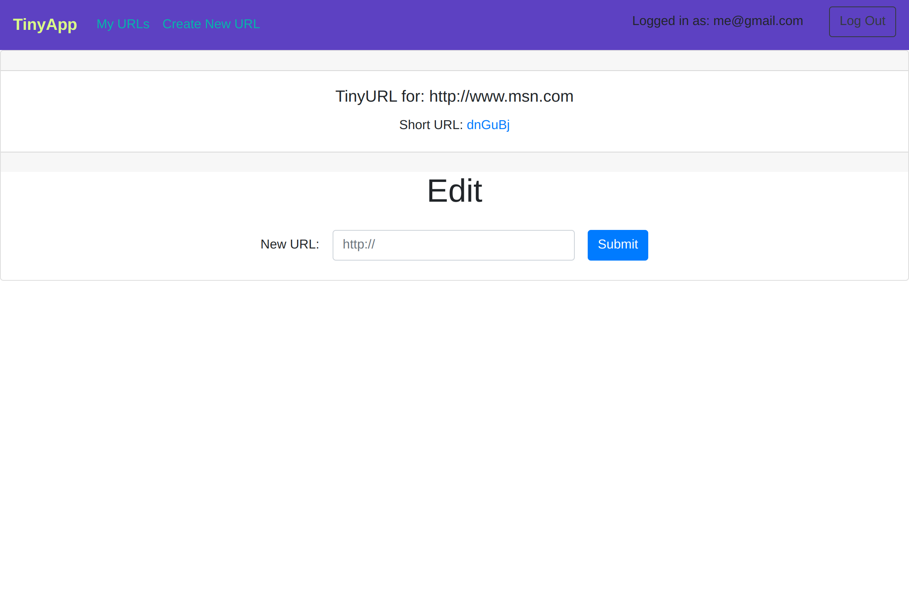

# TinyApp Project

TinyApp is a full stack web application built with Node and Express that allows users to shorten long URLs

## Author

- [Michaela King](https://github.com/Michaela-K)

## Final Product

Home Page

Page showing the logged in user's URL's

URL edit page

## Dependencies

- Node.js
- Express
- EJS
- bcrypt
- body-parser
- cookie-session

## Getting Started

- Install all dependencies (using the `npm install` command).
- Type npm start in your terminal and press the enter key
- Open the browser to http://localhost:8080/
- Register to start creating, editing and sharing your short Urls :)
